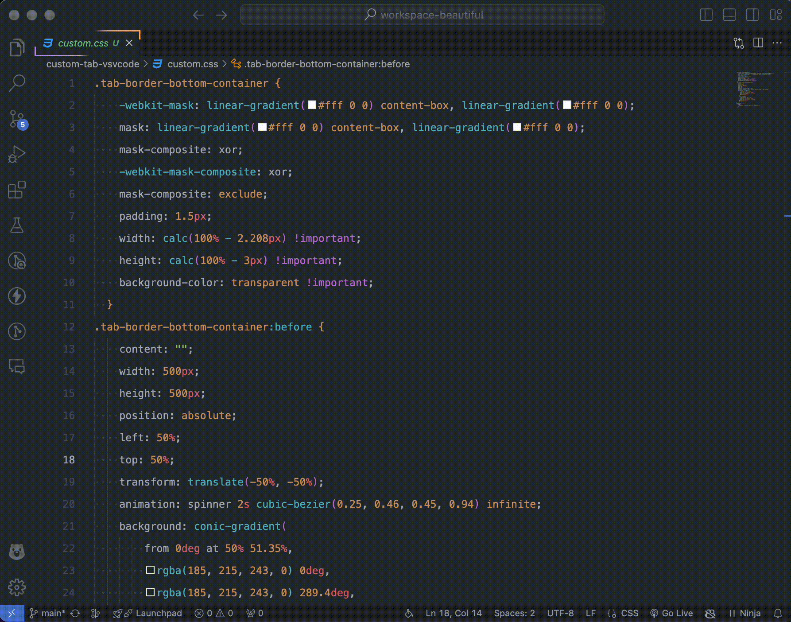
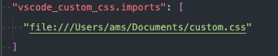
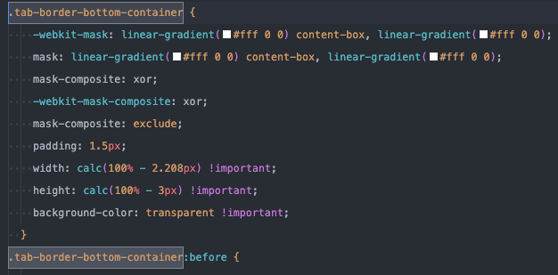
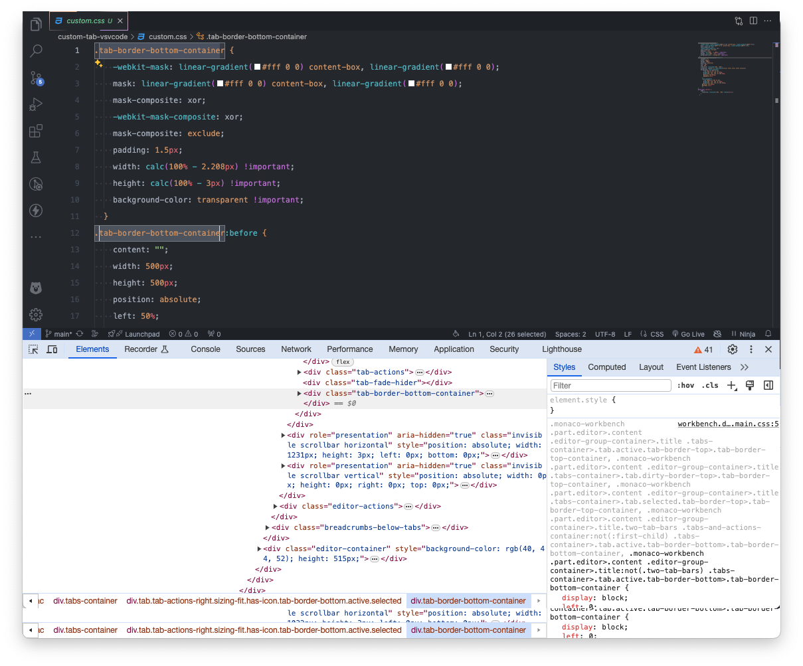

# Getting Started



1. Install extension Custom CSS and JS Loader
2. Add to `settings.json`:

    ```json
        "vscode_custom_css.imports": ["path"]
    ```
- `path`: must be URLs(absolute path) - file:///Users/MyUserName/Documents/custom.css
- Ex(MacOS): file:///Users/ams/Documents/custom.css

    
    
3. Class:
- name .tab-border-bottom-container can be different on version vscode. Please open toggle developer tools of vscode to check





