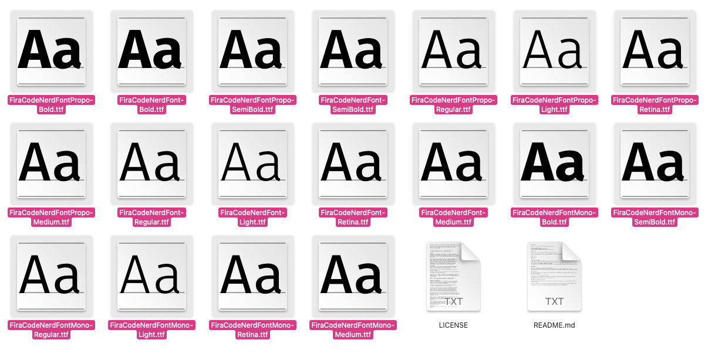
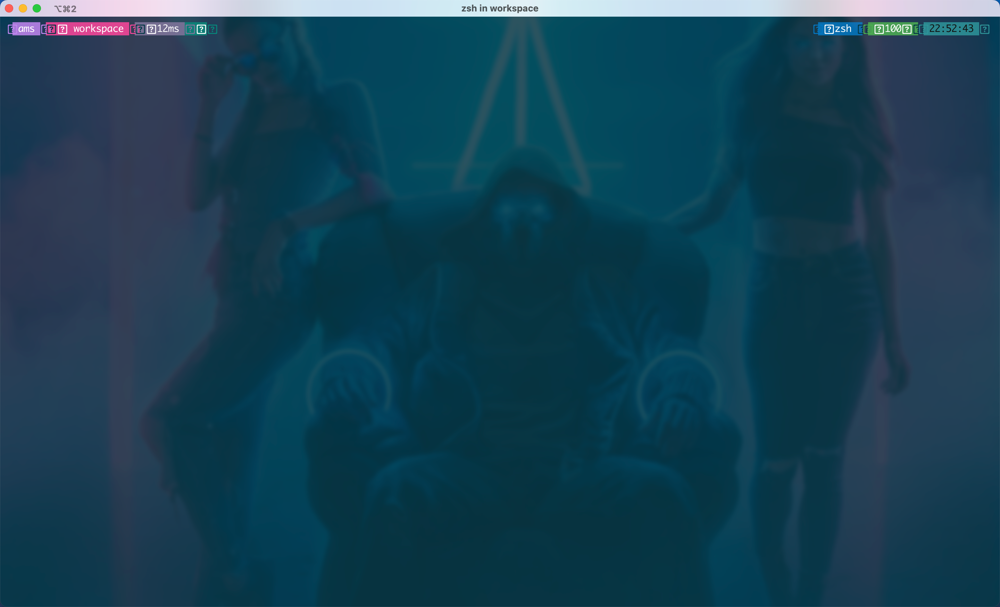
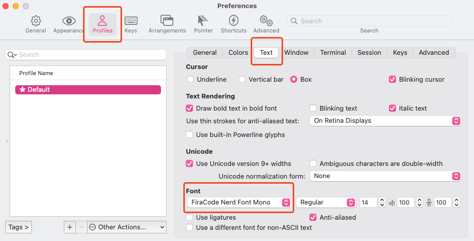
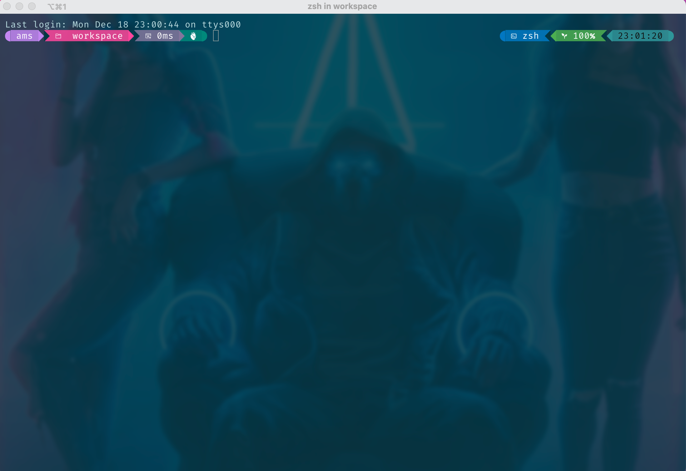
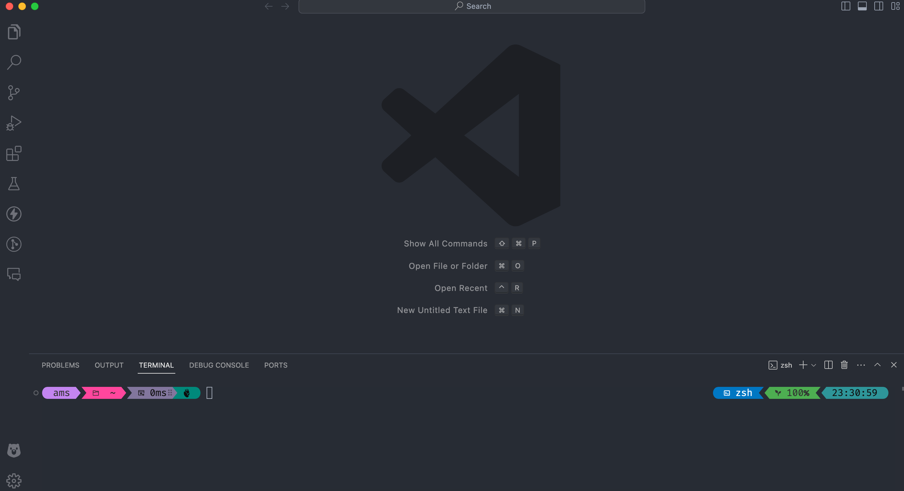

# Giới thiệu

1. Cài đặt Homebrew và iTerm2 
- Homebrew
```cmd
/bin/bash -c "$(curl -fsSL https://raw.githubusercontent.com/Homebrew/install/HEAD/install.sh)"
```
- Link tải iTerm2 [tại đây](https://iterm2.com/). 
2. Cài đặt font
- C1:
    - Mở iTerm2 sau khi cài đặt ở trên run 3 lệnh dưới:
```cmd
brew tap homebrew/cask-fonts
brew search nerd-font packages
brew install --cask font-fira-code-nerd-font
```
- C2:
    - Tải font [FiraCode Nerd Font](https://www.nerdfonts.com/font-downloads) từ trang chủ rồi xả nén ra
    - Mở Font Book(F4 -> Search Font Book) rồi copy toàn bộ font FiraCode Nerd Font tải ở trên(trừ 2 file LICENSE and README.md ra) về rồi paste vào Font Book nhé

3. Cài đặt Oh My Posh
- Install Oh My Posh
```cmd
brew install jandedobbeleer/oh-my-posh/oh-my-posh
```
- Config Oh My Posh tự chạy khi start iTerm2
    + Open **~/.zshrc**
    ```cmd
    open -a TextEdit ~/.zshrc
    ```
    + Add thêm script bên dưới vào **~/.zshrc** để chọn themes mặc định. Lưu ý **jandedobbeleer.omp.json** là tên themes
    ```cmd
    eval "$(oh-my-posh init zsh --config $(brew --prefix oh-my-posh)/themes/jandedobbeleer.omp.json)"
    ```
- Các bạn có thể lựa chọn themes mà mình thích [ở đây](https://ohmyposh.dev/docs/themes)
- Để thay themes nào thì các bạn lấy tên của themes đó, rồi thay vào script ở file  **~/.zshrc** cùng với tên mới là được. Ví dụ mình muốn sử dụng themes aliens(aliens.omp.json) thì script sẽ là:
```cmd
 eval "$(oh-my-posh init zsh --config $(brew --prefix oh-my-posh)/themes/aliens.omp.json)"
```
thì

- Sau khi cài thành công thì sẽ có nó sẽ `bị lỗi font như thế này. Chọn lại font mặc định của iTerm2 sang font tải ở trên là ok!

- Setup font FiraCode Nert Font cho iTerm2 (iTerm2 -> Setting -> chọn tab Profiles -> chọn tab Text)

- Setup font VS Code. Open setting.json bằng cách nhấn(command + shift + P) -> search setting.json rồi Enter. Thêm script này vào:
```cmd
"terminal.integrated.fontFamily": "FiraCode Nerd Font Mono",
```
4. Thành quả
- iTerm2:

- VSCODE


5. Custom Themes

```
cd /opt/homebrew/Cellar/oh-my-posh/19.2.1/themes
```